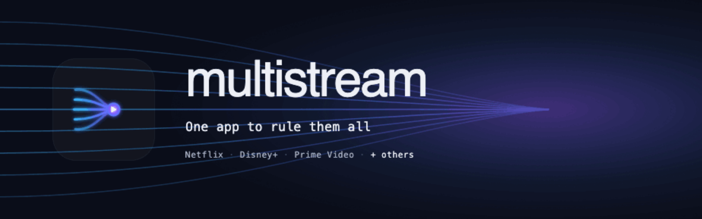

<p align="center">
  
</p>

<h1 align="center">multistream</h1>

<p align="center">
  One Android app (phone, tablet, <b>and</b> Android TV / Google TV) that federates the catalogs of
  your installed streaming apps.
</p>

<p align="center">
  <a href="https://github.com/renaudallard/multistream/releases/latest"></a>
  <a href="https://github.com/renaudallard/multistream/releases"></a>
  <a href="https://github.com/renaudallard/multistream/actions/workflows/ci.yml"></a>
  
  
  
  
</p>

Search across the services from one box, **browse by genre** without typing a query, see show
information, **launch directly** into the right app at the right title, and track **locally** what
you have watched and where you are in a series.

The eleven services: **Netflix**, **Disney+**, **Prime Video**, **Molotov**, **Zattoo**, **Arte**,
**Plex**, **RTBF Auvio**, **RTL Play**, **Play RTS**, **ICI Tou.tv**.

The interface is available in English and French, following the device language.

## Contents

- [How it works](#how-it-works)
- [Services and capabilities](#services-and-capabilities)
- [Episodes and watched state](#episodes-and-watched-state)
- [Login](#login)
- [Deep links](#deep-links)
- [Modules](#modules)
- [Build and run](#build-and-run)
- [Testing and verification](#testing-and-verification)
- [Legal / personal use](#legal--personal-use)

## How it works

Launch plus local watch-tracking is the always-works spine; catalog search is a best-effort,
per-provider capability layered on top. Each provider is a self-contained leaf module that
advertises `ProviderCapabilities` (can it search? browse by genre? deep-link a title? an episode? is
it live TV?),
and the UI reads those flags and degrades gracefully: a provider that cannot search still launches
and tracks. There is no DI framework. A small hand-written `AppGraph` wires everything and composes
the providers into a registry, so one flaky provider never breaks the app. Search fans out to every
enabled provider in parallel, merges the rows into one card per title across services, and ranks the
list by how closely each title matches the query (a full-phrase match before partial-word ones).
A provider that errors or times out during the search is named under the results ("No response
from: ..."), so missing rows are visible instead of looking like catalog misses.
Opening a series lists its episodes by asking every provider that can enumerate them and unioning the
results, so a service carrying the full run completes one that holds only part of it.

On each launch, on each return to the app and on each search the app asks GitHub for the latest
release (a conditional ETag request, throttled to once a minute) and, if it is newer than the
running build, shows a dismissible banner linking straight to the new APK. The check is
best-effort: offline, a rate-limited API, or any error just leaves the banner hidden until a later
check succeeds.

## Services and capabilities

The spine works for **all eleven**: deep-link launch, local watch tracking (watched/unwatched,
series next-episode, watchlist, continue-watching), a per-provider region setting, and one adaptive
shell for phone and Android TV.

| Service | Search | Genre | Launch | Details | Login | Notes |
|---|:--:|:--:|:--:|:--:|:--:|---|
| **Netflix** | ✅ | 8 | title page | cast, summary | WebView \* | title and in-app-search deep links; search verified on a real device, the session can need a fresh login after heavy use |
| **Disney+** | ✅ | 10 | title page | cast, summary | email / password | verified on a real device; films and series are typed correctly, so episodes list only for series |
| **Prime Video** | ✅ | 10 | detail page | summary | WebView \* | verified on a real device; the TV build is bundled and the mobile package is tried on phones; web-search art is 16:9 (no portrait) |
| **Molotov** | ✅ | 9 | program page | summary | email / password | verified on a real device; lists episodes from the channel-scoped program page; its API carries no cast |
| **Zattoo** | ✅ | — | live channel | — | email / password | live TV: deep-links to the program's live channel (`zattoo.com/live/<cid>`); the guide carries no synopsis |
| **Arte** | ✅ | 2 | title page | summary | optional | free public API; the region selects the catalog language |
| **Plex** | ✅ | 10 † | watch.plex.tv | cast, summary | optional | anonymous Discover; the device sign-in auto-discovers and searches your own server |
| **RTBF Auvio** | ✅ | 2 | title page | — | optional | free public API |
| **RTL Play** | ✅ | 1 | title page | cast, summary | — | catalog search and details via DPG Media's lfvp API (anonymous, but Belgium-only); needs a Belgian connection |
| **Play RTS** | ✅ | 4 | video page | — | — | free SRG SSR Integration Layer; video results only |
| **ICI Tou.tv** | ✅ | 9 | title page | cast, summary | optional | Radio-Canada's public catalog API (anonymous, worldwide); lists episodes; only playback is Canada-locked |

`✅ Search` = a real catalog query from this app. `Genre` = how many of the ten canonical genres
(Comedy, Drama, Horror, Action, Documentary, Sci-Fi, Crime, Romance, Animation, Kids) the service can
browse with no search term, from genre chips on the Search screen; public broadcasters organize their
catalogs by theme, so they map to fewer genres. `†` Plex browses the genres of your own server's
library, so it needs a connected server (and returns nothing for a Discover-only account). `\*` marks
a one-time WebView login. Search requires that login for Netflix and Prime Video, and the
email/password login for Disney+, Molotov and Zattoo; Arte, Plex, RTBF Auvio, RTL Play, Play RTS and
ICI Tou.tv search without a login. `Details` = what the title screen adds when you open a result: a
plot summary, and the billed cast where the service exposes it (a release year shows wherever search
returns one); `—` providers show the poster, title and year only.

Live search is verified on a real device across all eleven services, and genre browse on every service
that supports it. The search box carries a clear button that wipes the query in one tap, and leading or
trailing spaces are stripped before the search runs. Leave the search box empty and the genre chips
appear; tapping one fans out to the providers that carry that genre and merges the catalogs, exactly
like a text search. Genre results come back sorted alphabetically with an A-Z letter strip down the
right edge: tap or drag a letter to jump straight to those titles. A small built-in
sample catalog also ships for an offline demo; live search itself runs only on a device with network.

## Episodes and watched state

Opening a series fetches its episodes from every provider that can enumerate them and unions them by
season and episode number, so a service carrying the full run completes one that holds only part of
it. Plex lists episodes from your own server; Prime Video reads them from the signed-in detail page,
fetching one page per season so every season is covered; Molotov reads them from the channel-scoped
program page its search tiles point to.

Where a service exposes it, the detail screen also offers "Sync watched from <service>", which
imports which episodes you have already watched there into your local history. This is verified for
Netflix, Plex, Prime Video and Disney+. Prime reads each episode's playback progress across every
season; Disney+ collects every episode's id and batches them through its userState lookup, since its
catalog carries no inline progress. ICI Tou.tv (after the optional login) is limited by Radio-Canada's
API, which exposes only a continue-watching resume point per show, so it marks the current season up
to where you left off rather than a full history. A sync that fails (network error, expired session,
e.g. Tou.tv's access token lapses after about an hour) is reported as such instead of pretending you
have watched nothing.

## Login

Login is per-provider and never required for search except where noted above.

- **Netflix, Prime Video** open a one-time **WebView login** (Settings, "Log in (browser)") that
  captures cookies into the encrypted secret store. Their search needs it.
- **Disney+, Molotov, Zattoo** use an email and password form.
- **Plex** searches anonymously. The **optional** login is Plex's device sign-in (so it works with
  two-factor accounts): tap "Link account", approve in the browser at `app.plex.tv/auth` where any
  2FA is handled, and the app keeps the account token and auto-discovers your own Plex Media Server
  over its secure (https) connection (no token to paste), searching that server with a Discover
  fallback. A server with secure connections turned off is reached only through the Discover fallback.
- **Arte, RTBF Auvio** search without login. An **optional** WebView login captures the site session
  and passes it to the search best-effort.
- **RTL Play** has no login: its lfvp catalog API is anonymous (geo-restricted to Belgium), and an
  RTL account session applies to a different host, so it would not affect catalog search anyway.
- **Play RTS** has no login: its SRG SSR Integration Layer catalog is public, and an rts.ch account
  session applies to a different host, so it would not affect catalog search anyway.
- **ICI Tou.tv** searches without login (the catalog and detail endpoints are anonymous and answer
  worldwide). The **optional** login is Radio-Canada's account sign-in (Azure AD B2C) in a WebView; it
  captures the access token and unlocks importing your watch progress. Only playback is geo-locked to
  Canada, which stays inside the official app.

Secrets live in `EncryptedSharedPreferences`; clearing the app data or logging out wipes them.

## Deep links

Verified from each app's decoded manifest. Playback activities are never forced; multistream opens
the **title page** and the user presses play inside the official app.

- **Netflix** `https://www.netflix.com/title/<id>` (plus the `nflx://` scheme) and an in-app search
  deep link.
- **Disney+** `https://www.disneyplus.com/browse/entity-<id>`, with `disneyplus://<id>` as a fallback.
- **Prime Video** `https://app.primevideo.com/detail?gti=<ASIN>`. The bundled APK is the TV
  ("living-room") build; on phones the mobile package `com.amazon.avod.thirdpartyclient` is tried.
- **Molotov** `https://www.molotov.tv/fr_fr/p/<program_id>/<slug>` web links (the canonical program
  page from the site's sitemap), carried as a deep-link hint.
- **Zattoo** `https://zattoo.com/live/<cid>` opens the program's live channel (the app catches every
  `zattoo.com` URL; the `/live` route comes from its bundle).
- **Arte** `https://www.arte.tv/<lang>/videos/<id>/`, with `arte://collection/<id>` as a fallback.
- **Plex** `https://watch.plex.tv/<movie|show>/<slug>` for Discover hits; server-library hits have no
  public slug and open the Plex app.
- **RTBF Auvio** `https://auvio.rtbf.be<path>`.
- **RTL Play** `https://www.rtlplay.be/rtlplay/<slug>~<detailId>` opens the title; the in-app search
  row opens `https://www.rtlplay.be/rtlplay/recherche?q=<query>`.
- **Play RTS** `https://www.rts.ch/play/tv/redirect/detail/<id>` (the numeric id from the media URN).
- **ICI Tou.tv** `https://ici.tou.tv/<slug>` opens the show page in the Tou.tv app (package `tv.tou.android`).

## Modules

```
app                  UI (Compose + Compose for TV), navigation, hand-written AppGraph, sample catalog
core/model           pure Kotlin: Title/Season/Episode/Availability/ProviderRef/TitleKey,
                     normalizeTitle(), mergeResults(), computeNextEpisode()
core/data            Room (watch tracking), DataStore settings, encrypted secrets
core/net             shared OkHttp client, tolerant JSON helpers, in-memory cookie jar
provider/api         StreamingProvider interface, ProviderCapabilities, Launcher, DeepLinks, WebLoginSpec
provider/<service>   one leaf module per service:
                     netflix · disney · prime · molotov · zattoo · arte · plex · rtbf · rtl · rts · toutv
```

`core/*` and the feature screens never depend on a concrete provider; only `app` wires them, so a
flaky provider stays contained.

## Build and run

Prerequisites on this machine: **JDK 21** (`/usr/lib/jvm/java-21-openjdk-arm64`) and the **Android
SDK** at `~/Android/Sdk` (platform `android-35`, build-tools 35). The system `gradle` is too old, so
always use the wrapper. Toolchain: Kotlin 2.0.21, AGP 8.7.2, `compileSdk`/`targetSdk` 35, `minSdk` 24.

```bash
export JAVA_HOME=/usr/lib/jvm/java-21-openjdk-arm64
./gradlew assembleDebug      # -> app/build/outputs/apk/debug/multistream-debug.apk
./gradlew test               # runs the JVM unit tests
./gradlew installDebug       # installs to a connected device/emulator (adb)
```

Release build (signed and R8-shrunk):

```bash
# Signing creds live in keystore.properties (git-ignored): storeFile, storePassword, keyAlias, keyPassword.
# A dev key (multistream-release.keystore) is used by default; swap in your own for Play distribution.
./gradlew :app:assembleRelease   # -> app/build/outputs/apk/release/multistream.apk (~2.4 MB, v2-signed)
./gradlew :app:bundleRelease     # -> app/build/outputs/bundle/release/multistream-release.aab (Play upload)
```

`local.properties` (git-ignored) points Gradle at the SDK: `sdk.dir=/home/r/Android/Sdk`.

### Continuous integration

`.github/workflows/ci.yml` runs the unit tests, lint, and a debug build on every push to `master` and
on pull requests.

Releases are cut by hand so the signing key never leaves this machine: build the signed APK and
publish it with the GitHub CLI.

```bash
./gradlew :app:assembleRelease
gh release create vX.Y.Z --title "multistream X.Y.Z" --notes-file <notes> --latest \
  app/build/outputs/apk/release/multistream.apk
```

### Installing the target streaming apps (for deep-link testing)

They live in `apks/`. Netflix is a plain APK; the others are split `.xapk` bundles, so unzip and use
`install-multiple`:

```bash
adb install "apks/Netflix_9.65.0+build+9+64253_APKPure.apk"
# for each .xapk: unzip it, then
adb install-multiple <pkg>.apk config.*.apk
```

Verify a deep link directly:

```bash
adb shell am start -a android.intent.action.VIEW -d "https://www.netflix.com/title/80057281" com.netflix.mediaclient
```

## Testing and verification

JVM unit tests (run anywhere):

- `core/model` covers title reconciliation and merge (year tolerance, type guard, external-id match)
  and the next-episode computation.
- `provider/api` covers the deep-link URL formats (`DeepLinks`).
- Each searchable provider (`netflix`, `disney`, `prime`, `molotov`, `zattoo`, `arte`, `plex`,
  `rtbf`, `rts`, `rtl`, `toutv`) replays its API client against OkHttp `MockWebServer` (plain HTTP, no Android runtime).

Room DAO SQL is validated at compile time by the Room KSP processor.

**Environment limitation (this host):** it is headless **aarch64 with no `/dev/kvm`**, so the Android
emulator cannot run, and Robolectric cannot run either (Conscrypt ships no `linux-aarch_64` native).
Android-runtime tests (Room integration, intent resolution) and on-device runs must therefore happen
on an **x86_64 machine, a KVM-enabled host, or a physical device** over `adb`. Everything that does
not need an Android runtime is verified here: a working APK plus the JVM tests above.

## Legal / personal use

For personal use with your own accounts. The app never bypasses DRM: playback always happens inside
the official app. multistream only queries catalogs and fires a deep-link intent.
